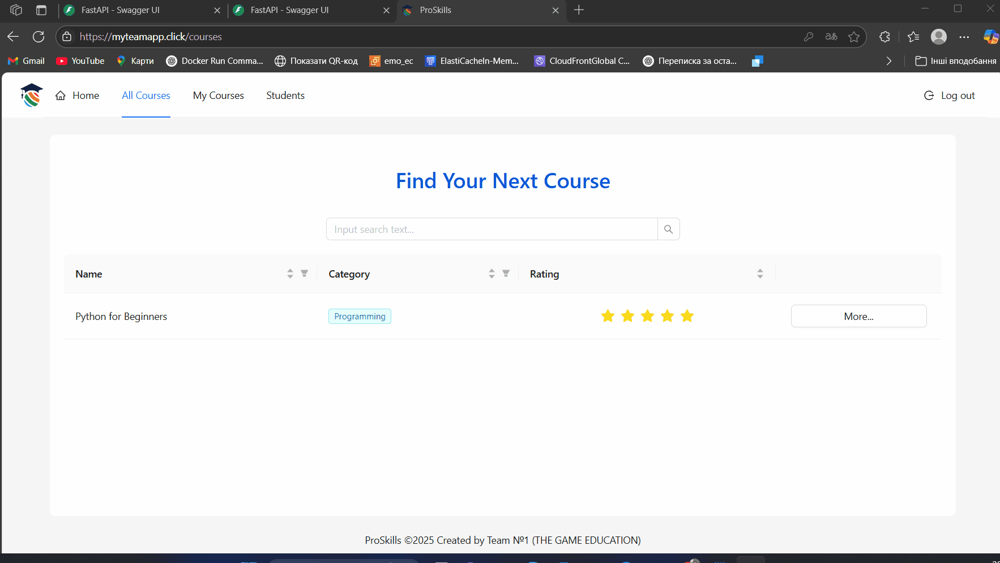

---

## 👨‍💻 DevOps Engineer Responsibilities

This is a private fullstack application project. I was solely responsible for building and managing the **DevOps infrastructure** and **CI/CD automation**. My key responsibilities included:

---

## 🧠 EC2 Manual Deployment Architecture

📈 [Open Diagram in Draw.io Viewer](https://viewer.diagrams.net/?url=https://raw.githubusercontent.com/vasylradashev/proskills-showcase/main/docs/architecture-ec2.drawio.png)

📘 Show Description

This diagram illustrates the **manual deployment** of the `proskills` backend project using **EC2** and **MobaXterm**.

- **Users** access the frontend via **CloudFront + S3**
- **ALB (Nginx)** is manually configured on an EC2 instance with **Certbot SSL**
- `/api` requests are proxied to **FastAPI** running inside a **Docker container**
- **Redis** and **PostgreSQL** also run as Docker containers on the same EC2
- Configuration and deployment are handled manually using `.env` files and SSH

---

### 🏗️ Infrastructure with Terraform

- Designed and implemented **modular infrastructure** using Terraform
- Created reusable modules for:
  - `network` – VPC, subnets, route tables, IGW, NAT Gateway
  - `security` – IAM roles, security groups
  - `alb` – Application Load Balancer with HTTPS (ACM)
  - `ecs` – Fargate services: FastAPI, PostgreSQL, Redis
  - `cloud map` – Service Discovery between containers
- Configured private DNS (`*.local`) for internal service communication

---

### ⚙️ Backend & Frontend Deployment

- Built CI/CD pipelines using **GitHub Actions**:
  - **FastAPI backend**: Docker build → push to **Amazon ECR** → deploy to **ECS Fargate** or EC2
  - **React frontend**: npm build → upload to **S3** → trigger CloudFront cache invalidation
- Integrated custom domains:
  - 🔗 `https://api.myteamapp.click`
  - 🔗 `https://myteamapp.click`

---

### 🐳 EC2 & Docker

- Manually tested backend deployment on EC2 with Docker:
  - FastAPI + Redis + PostgreSQL containers
  - Environment management via `.env`
  - Reverse proxy setup using Nginx
  - SSH access using `.pem` keys

---

### 🔐 HTTPS & Domains

- Configured HTTPS using **AWS ACM** and ALB listeners
- Managed DNS records using **Route53**
- Applied **Basic Auth** protection for the `/docs` route in Swagger (FastAPI)

---

### 🧪 Additional Tools

- `copy_structure.py` – Script to auto-generate the project folder structure
- `start.sh` – Shell script to bootstrap local development or deployment
- Maintained clean and modular separation in all Terraform configuration files

---

## 🔒 Access to Private Code

The actual backend and frontend code are stored in a **private GitHub repository**.  
If you're an employer, reviewer, or team member – please [contact me](mailto:vasiliyradashev24@gmail.com) for access.

---

## 🧠 Team & Course

This project was developed by **Team THE-GAME** as part of a **hands-on DevOps/Web Development course**.  
Each member was responsible for a real-world feature. My role focused entirely on DevOps and cloud infrastructure.

---

## 📷 Screenshots

> _You can add demo images, architecture diagrams, or GIFs here later._

---

### 📬 Contact

- 👤 **Name:** Vasyl Radashev  
- 🛠️ **Role:** DevOps Engineer (Infrastructure & CI/CD)  
- 🔗 **GitHub:** [Radashev](https://github.com/Radashev)  
- ✉️ **Email:** [vasiliyradashev24@gmail.com](mailto:vasiliyradashev24@gmail.com)

---

### 🧪 Frontend + Backend Integration

